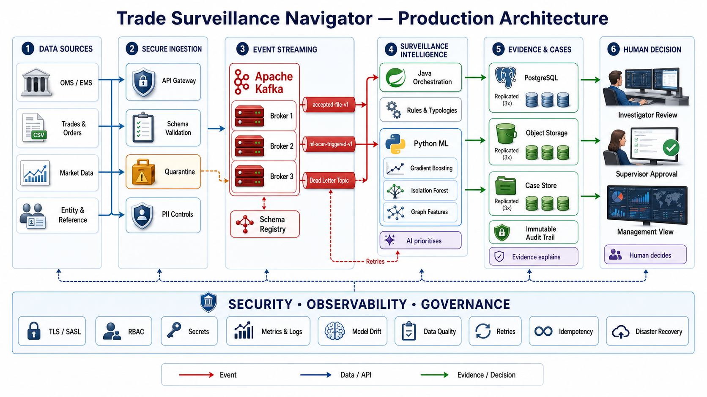
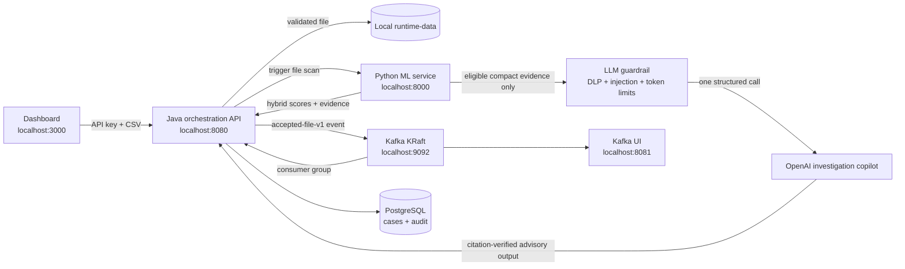

# Trade Surveillance Navigator

Context-aware, multi-typology surveillance and investigation copilot that transforms alerts into explainable, evidence-backed cases while preserving human accountability.

> **AI prioritises. Evidence explains. Human decides.**

## Project structure

- `dashboard/` — runnable interactive investigator workbench
- `backend-java/` — Java 21 / Spring Boot orchestration and investigator API
- `ml-service-python/` — Python / FastAPI scoring and ML service
- `runtime-data/` — local-only intake, model and scoring output (Git ignored)
- `sample-data/daily/` — small synthetic single-file and multi-part regional Parquet examples
- `docker-compose.yml` — starts dashboard, Java, Python and PostgreSQL
- `docker-compose.kafka.yml` — optional local Kafka/KRaft event-streaming overlay
- `specs/openapi.yaml` — OpenAPI 3.1 service contract
- `specs/data-model.sql` — audit-oriented reference data model
- `deliverables/Trade_Surveillance_Navigator_Demo_PPT.pptx` — latest professional walkthrough deck
- `deliverables/Trade_Surveillance_Navigator_Demo_Project.zip` — portable source, documentation, deck and synthetic input samples

## What is now demonstrable

- **Live scenario lab** — change pattern strength, entity linkage, legitimate market context and evidence completeness; the score and explanation respond immediately.
- **Separate data input layer** — upload CSV data, enforce the canonical schema, quarantine invalid or duplicate rows, preview quality and release validated records only.
- **Recognisable typologies** — wash trading, spoofing/layering and front-running golden paths, plus a contextual low-risk control.
- **Hybrid prioritisation** — rules, behavioural anomaly, graph relationships and risk-reducing context contribute separately.
- **Evidence grounding** — every material claim links to source IDs; below 75% evidence coverage the copilot abstains from generating a factual narrative.
- **Controlled workflow** — rationale and acknowledgement are mandatory; closure requires supervisor authority; all actions create audit events.
- **Management value** — precision, false-positive reduction, case ageing, typology concentration, drift and data-quality indicators.
- **Failure controls** — degraded rule-only operation, retry handling, stale-graph suppression and idempotent event processing are documented in `docs/ROBUSTNESS.md`.

## Runtime architecture

### Target architecture



The production view includes Kafka broker replication, a schema registry, a dead-letter path, separate evidence stores, human investigation and approval, plus cross-cutting security, observability and governance controls. The Docker setup in this repository implements the same logical event flow in a single-node local form.

### Local runtime flow



Kafka carries file metadata, fingerprints and workflow events—not the raw CSV content. Input data remains inside the ignored `runtime-data/` boundary. Java uses a SHA-256 file fingerprint as the Kafka key, and Python independently fingerprints completed files so duplicate delivery cannot produce duplicate scoring work.

## Run the dashboard

Requirements: Node.js 22+ and pnpm.

```bash
cd dashboard
pnpm install
pnpm dev
```

Open `http://localhost:3000`.

Production build:

```bash
pnpm build
pnpm start
```

## Run the complete application

Requirements: Docker Desktop. Allocate at least 6 GB of Docker memory for the full Kafka stack.

### Recommended: complete stack with Kafka

```bash
cd /Users/shivamshukla/Documents/HACKTHON
cp .env.example .env
docker compose -f docker-compose.yml -f docker-compose.kafka.yml up -d --build
./scripts/kafka-smoke-test.sh
```

The first build downloads Kafka and application dependencies. Later starts reuse Docker layers and the persistent Kafka volume.

### Lightweight stack without Kafka

```bash
cp .env.example .env
docker compose up -d --build
```

- Java API: `http://localhost:8080`
- Python scoring API and documentation: `http://localhost:8000/docs`
- Dashboard: `http://localhost:3000`
- PostgreSQL: `localhost:5432`

### Kafka components and event contract

The Kafka overlay adds a single-node KRaft broker and Kafka UI while retaining the file watcher as a safe fallback. Validated files publish an `accepted-file-v1` event, Java consumes it and triggers the Python ML scan, and a second event records that the scan was dispatched. Producer idempotence, record-level acknowledgements, three retry attempts and a dead-letter topic are configured.

- Kafka broker for local tools: `localhost:9092`
- Kafka UI: `http://localhost:8081`
- Integration status: `GET http://localhost:8080/v1/integration/kafka`
- Accepted files: `surveillance.file.accepted.v1`
- ML scan triggered: `surveillance.ml.scan.triggered.v1`
- Dead letter: `surveillance.file.accepted.v1.dlt`

| Topic | Producer | Consumer/purpose |
| --- | --- | --- |
| `surveillance.file.accepted.v1` | Java file gateway | Java ML-dispatch consumer group |
| `surveillance.ml.scan.triggered.v1` | Java ML-dispatch consumer | Operational confirmation that Python scanning was invoked |
| `surveillance.file.accepted.v1.dlt` | Kafka retry recovery | Failed events after three retries for operator investigation |

The Kafka-enabled upload sequence is:

1. Dashboard performs immediate client-side CSV checks.
2. Java streams the file to the isolated inbound area.
3. Java validates the filename and required schema, then routes it to accepted or rejected storage.
4. For accepted files, Java calculates a SHA-256 fingerprint and publishes an event with `acks=all` and producer idempotence.
5. The Java consumer reads the event using consumer group `trade-surveillance-navigator-v1` and triggers Python ML scanning.
6. Python processes the CSV in bounded chunks and skips fingerprints already completed.
7. Java synchronises explainable cases to PostgreSQL; human decisions create immutable audit events.

### Inspect Kafka

Open `http://localhost:8081` to inspect brokers, topics, partitions, consumer groups and message payloads. The application status endpoint shows delivery counters and the most recent error:

```bash
curl -H "X-Aegis-Key: ${AEGIS_API_KEY:-hackathon-local-change-me}" \
  http://localhost:8080/v1/integration/kafka
```

List topics from the broker container:

```bash
docker compose -f docker-compose.yml -f docker-compose.kafka.yml \
  exec kafka /opt/kafka/bin/kafka-topics.sh \
  --bootstrap-server localhost:29092 --list
```

Expected healthy status includes `enabled: true`, `mode: KAFKA_EVENT_DRIVEN`, increasing `published` and `consumed` counters, and zero failure counters.

### Reliability and fallback

- Kafka uses KRaft mode and does not require ZooKeeper.
- The local broker has three partitions per surveillance topic and one replica because it is a single-node developer environment.
- Producer idempotence and `acks=all` prevent common duplicate/lost-send scenarios.
- Consumer offsets are acknowledged per successfully handled record.
- Processing failures are retried three times, then routed to the dead-letter topic.
- If Kafka publishing is unavailable, the accepted file remains safely stored and the Python file watcher provides the fallback processing path.
- Kafka data survives container recreation in the named `kafka-data` Docker volume.

### Stop and restart

Stop containers while preserving PostgreSQL and Kafka data:

```bash
docker compose -f docker-compose.yml -f docker-compose.kafka.yml down
```

Restart the Kafka-enabled stack:

```bash
docker compose -f docker-compose.yml -f docker-compose.kafka.yml up -d
```

To return to the non-Kafka stack, stop the overlay and start the base compose file:

```bash
docker compose -f docker-compose.yml -f docker-compose.kafka.yml down
docker compose up -d
```

### Kafka troubleshooting

```bash
# See container health
docker compose -f docker-compose.yml -f docker-compose.kafka.yml ps

# Inspect broker and Java consumer logs
docker compose -f docker-compose.yml -f docker-compose.kafka.yml logs --tail=200 kafka java-api

# Re-run the end-to-end event test
./scripts/kafka-smoke-test.sh
```

If port `9092` or `8081` is already used, stop the conflicting local service or change the host-side port in `docker-compose.kafka.yml`. Do not use `docker compose down -v` unless you intentionally want to delete the local PostgreSQL and Kafka volumes.

### Production boundary

The local single-node broker demonstrates the event contract and operational flow; it is not a production Kafka cluster. Production requires at least three brokers, replication factor three, TLS/SASL, access-control lists, managed secrets, schema compatibility controls, monitoring and alerting, capacity testing, backup/recovery procedures, and a governed deployment platform.

## Use the daily regional input layer

Open **Data input** and select a region, business date, batch ID, one alert JSON/JSONL file, and either one Parquet file or multiple Parquet part files. Java validates and fingerprints every file before writing a single ready manifest. Python processes only ready manifests, scans every Parquet part in bounded record batches, and writes a separate enrichment result; the original Java alert is never overwritten or automatically closed.

The batch contract is:

- exactly one `alerts.json` or `alerts.jsonl` containing existing Java rule alerts;
- one or more `.parquet` files containing the corresponding regional trade context;
- one business date and one region (`AMER`, `EMEA`, `APAC`, or `GLOBAL`) shared by all records;
- a unique batch ID. A ready batch is immutable; replacement data requires a new batch ID.

Required alert fields are `alertId`, `ruleId`, `ruleVersion`, `typology`, `assetClass`, `businessDate`, `region`, and `triggeringTradeIds`. Every Parquet part must include `trade_id`, `event_time`, `instrument`, `asset_class`, `region`, `side`, `quantity`, `price`, `account_id`, and `client_id`.

Submit the alert contract first:

```bash
curl -H "X-Aegis-Key: ${AEGIS_API_KEY:-hackathon-local-change-me}" \
  -F file=@/approved/EMEA/2026-09-05/alerts.jsonl \
  http://localhost:8080/v1/ingestion/daily-batches/EMEA/2026-09-05/SURV-20260905-EMEA/alerts
```

Submit a single Parquet file using one `files` field, or repeat the field for a multi-part day:

```bash
curl -H "X-Aegis-Key: ${AEGIS_API_KEY:-hackathon-local-change-me}" \
  -F files=@/approved/EMEA/2026-09-05/trades-part-00001.parquet \
  -F files=@/approved/EMEA/2026-09-05/trades-part-00002.parquet \
  http://localhost:8080/v1/ingestion/daily-batches/EMEA/2026-09-05/SURV-20260905-EMEA/trades
```

Check readiness and ML reconciliation:

```bash
curl -H "X-Aegis-Key: ${AEGIS_API_KEY:-hackathon-local-change-me}" \
  http://localhost:8080/v1/ingestion/daily-batches/EMEA/2026-09-05/SURV-20260905-EMEA/readiness
curl http://localhost:8000/v1/daily-batches
```

Completed daily enrichments are exposed as bounded case-level results at `GET /v1/daily-batches/cases`. Java synchronises these clusters into PostgreSQL, so the normal Cases and Management views reflect the newly processed daily input rather than a separate demonstration path.

Generate a synthetic two-part batch inside Docker (set `--parquet-parts 1` to demonstrate the single-file form):

```bash
docker compose run --rm ml-service sh -c \
  "PYTHONPATH=/app python scripts/generate_daily_batch.py --output /data/sample-daily/region=EMEA/business_date=2026-09-05/batch_id=SURV-20260905-EMEA --region EMEA --business-date 2026-09-05 --batch-id SURV-20260905-EMEA --rows 5000 --parquet-parts 2"
```

Input files, trained artifacts, feedback, rolling state and ML outputs remain under the Git-ignored `runtime-data/` boundary. Kafka carries metadata events only; raw Parquet and direct identifiers are not sent to Kafka or the LLM.

### Legacy CSV gateway

### Backend file-drop configuration

The Java backend also provides a configurable file gateway. Edit `backend-java/config/input-files.yml` to add datasets, filename patterns, required columns or change which files are mandatory. Safe defaults remain bundled in `application.yml`. By default it requires trade, order, account and entity CSV files; market data is optional.

Docker stores the files under `runtime-data/input`, separated into `inbound`, `accepted` and `rejected` folders for every dataset. Override the root with `AEGIS_INPUT_ROOT` and the 2 GB limit with `AEGIS_INPUT_MAX_BYTES`. File copies are streamed, so large inputs are not loaded into Java memory.

Upload through the API:

```bash
curl -H "X-Aegis-Key: ${AEGIS_API_KEY}" \
  -F file=@/your/local/path/trades.csv \
  http://localhost:8080/v1/ingestion/files/trades
```

Or copy matching files into `runtime-data/input/inbound/<dataset>/` and call `POST /v1/ingestion/files/scan`. Use `GET /v1/ingestion/files/configuration` to inspect the active contract and `GET /v1/ingestion/files/readiness` to see whether every required dataset is available.

## Demo cases

1. `WT-102` — linked-account round trips (`94 HIGH`).
2. `SP-204` — layered orders and cancellations consistent with a spoofing review scenario (`91 HIGH`).
3. `FR-118` — employee activity preceding client orders (`87 HIGH`).
4. `WT-071` — market context reduces a rule alert to medium priority.
5. `WT-088` — historical behaviour and genuine exposure reduce concern.

Start with **Scenario lab**, change the inputs, and run the assessment. Then open `WT-102` to demonstrate the score journey, claim-to-evidence lineage, graph risk lift, controlled human workflow, model governance and management outcomes.

## ML algorithms currently implemented

| Component | Algorithm | Purpose |
| --- | --- | --- |
| Supervised detection | `HistGradientBoostingClassifier` | Learns suspicious behavioural combinations from labelled records. |
| Probability calibration | `CalibratedClassifierCV` with sigmoid calibration | Makes the classifier probability more meaningful for prioritisation. |
| Anomaly detection | `IsolationForest` | Identifies unusual behaviour, including patterns weakly represented in training. |
| Transparent scoring | Weighted rules with logistic transformation | Provides explainable risk drivers and risk reducers. |
| Hybrid ensemble | Existing Java rule score + supervised ML + anomaly score | Produces the advisory prioritisation score without replacing the alert. |
| Entity/graph intelligence | Common-control and relationship-derived features | Raises priority where tokenised accounts or entities appear connected and clusters related alerts into cases. |
| Model disagreement | Ensemble score spread + uncertainty band | Identifies ambiguous cases where rules, calibrated ML and anomaly detection disagree and deeper review has the most value. |
| Local micro-RAG | TF-IDF/cosine retrieval over approved playbooks | Selects up to two relevant asset-class and typology guidance snippets without an embedding call or external token usage. |
| OpenAI LLM | One structured Responses API call | Produces a cited summary, legitimate counter-hypothesis, next-best actions, missing-evidence list and confidence note; it does not score or decide. |

The daily ensemble is configured as 30% existing Java rule score, 55% supervised probability, and 15% anomaly score. Region and asset-class thresholds are explicit configuration, original alerts remain immutable, and investigator outcomes are stored as governed feedback rather than triggering uncontrolled online retraining.

The LLM consumes verified structured evidence only. It does not calculate surveillance metrics, assign the risk score, determine that abuse occurred, or autonomously close cases. Local ML processes every record; the LLM is reserved for sufficiently grounded high-priority or high-disagreement cases.

### Token-efficient OpenAI investigation copilot

The OpenAI integration is server-side in the Python service and is disabled by default. It sits behind an independent guardrail layer and makes at most one structured Responses API call per eligible, uncached evidence packet. The call returns five investigator aids together: a cited summary, a legitimate counter-hypothesis, next-best actions, missing evidence and a confidence note. Rules and trained ML continue to calculate the surveillance score.

The token-efficient path is:

1. Local rules, calibrated gradient boosting, Isolation Forest and graph features score every alert.
2. The eligibility gate spends zero LLM tokens unless evidence coverage is at least 75% and either priority is at least 70 or model disagreement is at least 0.35.
3. Strict schemas and pre-call DLP reject unknown fields, secrets, direct identifiers, prompt injection and over-budget packets.
4. Local micro-RAG retrieves at most two short approved asset/typology playbooks; no embedding API call is made.
5. One call uses a maximum estimated input of 1,800 tokens and a maximum output of 450 tokens, with low verbosity on compatible models, `store=false` and no tools.
6. Post-call controls validate the JSON structure, evidence citations, sensitive output and the human-decision boundary.
7. A local fingerprint cache makes repeated identical requests zero-token cache hits.

See [the controlled LLM boundary](docs/LLM_GUARDRAILS.md) for the data-flow diagram, threat controls and production limitations.

1. Copy the example environment file without committing it:

```bash
cp .env.example .env
```

2. Add a Platform API key and an explicitly approved model to `.env`:

```dotenv
LLM_ENABLED=true
OPENAI_API_KEY=replace-with-your-platform-api-key
OPENAI_MODEL=replace-with-your-approved-model
LLM_MIN_PRIORITY=70
LLM_MIN_EVIDENCE_COVERAGE=0.75
LLM_MIN_MODEL_DISAGREEMENT=0.35
LLM_MAX_INPUT_TOKENS=1800
LLM_MAX_OUTPUT_TOKENS=450
```

Never put the OpenAI key in `NEXT_PUBLIC_*`, the dashboard source, a Docker image or Git. ChatGPT subscription usage is separate from OpenAI Platform API billing.

3. Rebuild the Python service and verify configuration without exposing the key:

```bash
docker compose up -d --build ml-service
curl http://localhost:8000/v1/llm/status
```

The status response exposes controls, thresholds and aggregate token counters but never the key. Generate the full guarded analysis through the Java orchestration layer:

```bash
curl -X POST http://localhost:8080/v1/cases/WT-102/copilot \
  -H "X-Aegis-Key: ${AEGIS_API_KEY:-hackathon-local-change-me}" \
  -H 'Content-Type: application/json' \
  -d '{
    "caseId":"WT-102",
    "alertId":"ALT-WT-102",
    "region":"EMEA",
    "assetClass":"FIXED_INCOME",
    "typology":"WASH_TRADING",
    "priority":94,
    "evidenceCoverage":0.92,
    "modelDisagreement":0.42,
    "riskDrivers":["Seven opposing cycles within the review window"],
    "riskReducers":["Moderate volatility context"],
    "timeline":["10:31:04 Account A-104 BUY", "10:31:12 Account A-882 SELL"],
    "entityRelationships":["Ownership:O29 supports common control through UBO-72"],
    "evidenceRefs":["Trade:T183", "Trade:T187", "Ownership:O29", "Position:P905"],
    "dataGaps":["Market-depth evidence incomplete"]
  }'
```

Low-value or insufficiently grounded cases return `GATED` with `tokensUsed: 0`. When `LLM_ENABLED=false`, local scoring, file ingestion and human review continue normally; an eligible request returns `503` instead of silently generating unsupported content.

## Trained ML and thousand-record demonstration

The Python service now loads a persisted hybrid artifact containing a calibrated `HistGradientBoostingClassifier` and an `IsolationForest`. On the first Docker startup it trains an 8,000-row deterministic synthetic demonstration artifact under `runtime-data/models`; later restarts reuse that version. Runtime settings are controlled by `MODEL_PATH`, `MODEL_REQUIRED`, `ML_BATCH_SIZE`, `ML_BATCH_WORKERS` and `ML_MODEL_WEIGHT`.

The Python service watches locally accepted trade files every five seconds, extracts surveillance features in streaming 10,000-record chunks and writes scored JSON Lines plus a summary to `runtime-data/ml-output`. Java synchronises the highest-priority results into PostgreSQL-backed cases. Fingerprinted completion records prevent an unchanged file from being scored twice.

### Million-record file provision

Million-record processing uses the file pipeline, not the JSON batch endpoint. The configured path accepts up to 2 million records per file, scores in bounded 10,000-record chunks, retains at most 250,000 entity/instrument state keys, runs at most two files concurrently, reserves 1 GB of output disk and writes atomic progress after every chunk. These controls are configured with `ML_FILE_CHUNK_SIZE`, `ML_MAX_FILE_RECORDS`, `ML_MAX_STATE_KEYS`, `ML_FILE_WORKERS` and `ML_MIN_FREE_DISK_BYTES`.

For better recovery and parallelism, split one million rows into ten 100,000-row files:

```bash
python3 ml-service-python/scripts/generate_trade_file.py \
  --records 1000000 --output /tmp/trades-million.csv

python3 ml-service-python/scripts/partition_trade_file.py \
  /tmp/trades-million.csv --rows-per-part 100000

curl -X POST http://localhost:8080/v1/ingestion/files/scan
```

Progress is available while files are running:

```bash
curl http://localhost:8000/v1/file-jobs
```

Partition completion is restart-safe: completed fingerprints are skipped after restart. A partition interrupted mid-processing is safely recomputed from its beginning; it is not falsely marked complete.

The validated local million-row benchmark completed a 91 MB CSV in 78.3189 seconds at 12,768.31 records/second with one file worker. See `docs/PERFORMANCE.md` for boundaries and qualification.

Generate and submit 5,000 feature records without storing them in Git:

```bash
python3 ml-service-python/scripts/generate_batch_request.py --output /tmp/feature-batch-5000.json
curl -X POST http://localhost:8000/v1/batch-score \
  -H 'Content-Type: application/json' \
  --data @/tmp/feature-batch-5000.json
```

The submission returns a `jobId`. Poll `GET /v1/batch-jobs/{jobId}` for status, measured duration, records per second and results. Requests are processed asynchronously in configurable 1,000-record vectorised chunks, with a maximum of 10,000 records per job.

Train from approved labelled outcomes by supplying a CSV containing `label` plus all feature names:

```bash
docker compose run --rm ml-service sh -c \
  "PYTHONPATH=/app python scripts/train_model.py --training-data /approved/training.csv --output /app/models/surveillance-model.joblib"
```

The bundled artifact proves real training, persistence, loading and inference, but remains marked `productionApproved: false` because its default training data is synthetic. Production approval requires temporally separated validation on governed historical outcomes, bias assessment, model governance sign-off and monitoring thresholds.

All prototype records and metrics are synthetic. They demonstrate the control design and must not be represented as production performance without validation on approved, representative historical data.
