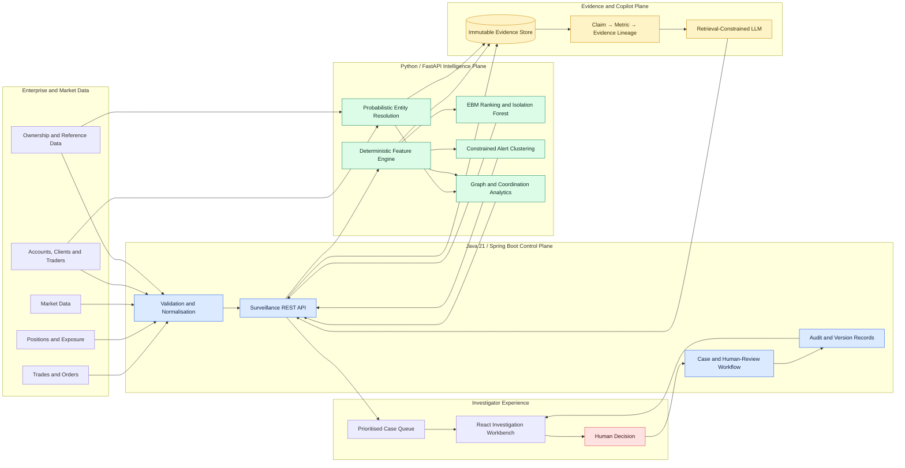

# Trade Surveillance Navigator — Solution Architecture

## Technology boundary

- Java owns APIs, validation, orchestration, workflow, decisions and audit records.
- Python owns deterministic surveillance features, statistical/ML scoring, clustering, entity resolution and graph analytics.
- The LLM receives verified evidence only and generates cited summaries; it does not calculate risk or decide whether abuse occurred.
- The investigator remains the only authority for escalation, further review, false-positive disposition or closure.
