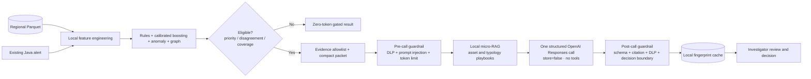

# Controlled LLM boundary

The investigation copilot is an advisory layer above the existing Java alerts and local Python models. It never receives a daily Parquet file, does not calculate the surveillance score and cannot disposition a case.



## Data that can cross the boundary

Only an explicitly allowlisted, compact evidence packet can be sent:

- case and alert references;
- region, asset class and typology;
- advisory priority, evidence coverage and model-disagreement values;
- a bounded set of risk drivers, risk reducers, timeline events and tokenised relationship descriptions;
- evidence reference IDs and known data gaps;
- up to two short playbook excerpts retrieved locally.

The endpoint does not accept files or arbitrary key/value payloads. Pydantic rejects unknown fields and Java validates the same bounded request contract before proxying it.

## Guardrail controls

| Control | Enforcement | Safe outcome |
| --- | --- | --- |
| Schema allowlist | Strict request and response models reject unknown fields. | Request fails; no LLM call. |
| Raw-data isolation | The copilot endpoint accepts structured JSON only; the batch pipeline never passes Parquet rows to it. | Local ML continues without LLM. |
| Sensitive-data loss prevention | Pre-call pattern checks block API keys, private keys, email addresses, IBANs, credential assignments and long account-like numbers. | HTTP 422; content stays local. |
| Prompt-injection defence | Evidence text is scanned for instruction override, prompt extraction and exfiltration patterns. | HTTP 422; no LLM call. |
| Data minimisation | Lists, item lengths and selected evidence are bounded; only top evidence and two local playbooks enter the compact packet. | Excess input is rejected or excluded before the boundary. |
| Token budgets | Estimated input is limited to 1,800 tokens and output to 450 tokens by default. | Over-budget packets are blocked; no silent truncation of evidence. |
| Provider retention control | Every call sets `store=false`; the LLM has no tools and cannot fetch files or internal systems. | No application-managed response storage at the provider and no agentic action path. |
| Structured output | A strict JSON Schema permits only summary, counter-hypothesis, next actions, missing evidence, confidence note and citations. | Malformed or extra output is rejected. |
| Citation verification | Every cited ID must be present in the supplied evidence allowlist and attached to narrative text. | Unsupported citations are blocked. |
| Output DLP | The response is scanned again before being shown. | Unsafe content is withheld. |
| Decision boundary | Language that asserts guilt or recommends autonomous closure is blocked. The response always says `HUMAN_REVIEW_REQUIRED`. | Investigator retains accountability. |
| Failure isolation | Timeout, provider error, disabled configuration or guardrail failure does not affect local scoring. | Structured evidence remains available without an LLM narrative. |

Pattern checks are a strong demonstration control, not a complete enterprise DLP substitute. Production should add tokenisation at source, an approved DLP/classification service, tenant-specific policies, regional routing, encrypted audit logs, red-team tests and contractual provider retention controls.

## Accuracy and cost design

The LLM is invoked only when evidence coverage is sufficient and the case is either high priority or the local models materially disagree. This sends ambiguous, valuable cases to the copilot while keeping routine cases at zero LLM tokens.

Local micro-RAG uses a small approved playbook library and pure local retrieval. It does not call an embedding model. One structured call produces all investigation aids together, and a content fingerprint cache prevents a repeated case packet from consuming tokens again. Prompt version, model and packet content are part of the cache key so stale answers are not silently reused after a governed change.

This improves investigation consistency and evidence coverage. It does not by itself improve the detector's statistical precision. Detector accuracy must be demonstrated separately using temporally separated, labelled historical data, calibration, threshold tuning, drift monitoring and investigator feedback.

## Operational configuration

```dotenv
LLM_ENABLED=true
OPENAI_API_KEY=replace-with-your-platform-api-key
OPENAI_MODEL=replace-with-your-approved-model
LLM_PROMPT_VERSION=investigation-copilot-v1
LLM_MIN_PRIORITY=70
LLM_MIN_EVIDENCE_COVERAGE=0.75
LLM_MIN_MODEL_DISAGREEMENT=0.35
LLM_MAX_INPUT_TOKENS=1800
LLM_MAX_OUTPUT_TOKENS=450
```

Do not put the API key in dashboard variables, source files, Docker images, sample data or Git. Use an enterprise secrets manager outside the local demonstration.
